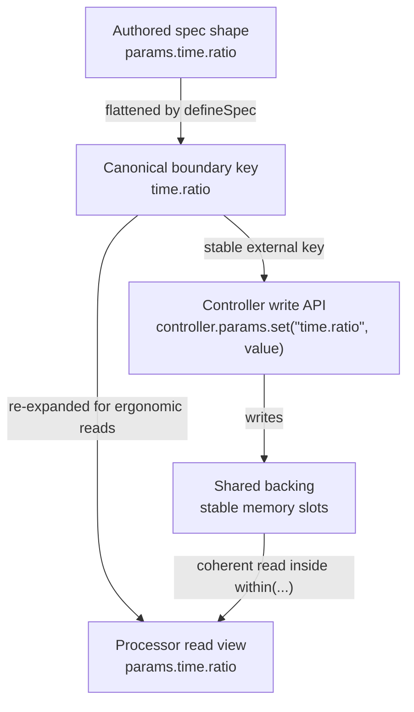

# Authored AST vs Runtime Contract

Authors can write nested specs because nested objects are easier to read and review:

```ts
const spec = defineSpec(({ param }) => ({
  params: {
    filter: {
      cutoff: param.f32({ min: 20, max: 20_000 }),
      enabled: param.bool(),
    },
  },
}));
```

The runtime contract is canonical and flat:

```ts
spec.params["filter.cutoff"];
spec.params["filter.enabled"];
```

The dot-key contract is what controllers use for dynamic writes, snapshots, and deterministic layout. Processor read views also expose nested aliases for ergonomic coherent reads.

## Canonical Keys and Read Views

Authored nested paths are flattened into canonical boundary keys. Controller write APIs intentionally use those string keys because they are the stable external contract.



Use canonical dot keys for controller writes, snapshot key lists, diagnostics, generated artifacts, and spec maps such as `spec.params["time.ratio"]`. Use nested property access in processor read examples when the read view supports it, for example `params.time.ratio` inside `within(...)`.

```ts twoslash
import { defineSpec, type ParamValues } from "@exclave/boundary";

const spec = defineSpec(({ param, meter }) => ({
  id: "authoring/filter" as const,
  params: {
    filter: {
      cutoff: param.f32({ min: 20, max: 20_000 }),
      enabled: param.bool(),
      mode: param.enum(["lowpass", "highpass"]),
    },
  },
  meters: {
    filter: {
      peak: meter.f32(),
    },
  },
}));

spec.params["filter.mode"];

type ControllerParamValues = ParamValues<typeof spec>;
```

## Why Canonical Keys Matter

Canonical dot keys are stable across controller writes, snapshot selection, plan generation, diagnostics, and generated examples. They also keep dynamic UI or automation code honest: a controller can update `"filter.cutoff"` without needing the authored nested object at runtime.

## Conflict Rules

A leaf and namespace cannot claim the same canonical dot key. For example, `params.engine` as a leaf conflicts with `params.engine.frame` as a descendant. This prevents ambiguous runtime memory layout.

## Why This Matters

- Generated layouts are deterministic.
- Handoff artifacts carry the planned contract, not an implicit local reconstruction.
- Type inference follows the contract from spec to binding.
- Runtime examples can prove the key names through Twoslash rather than relying on prose.
