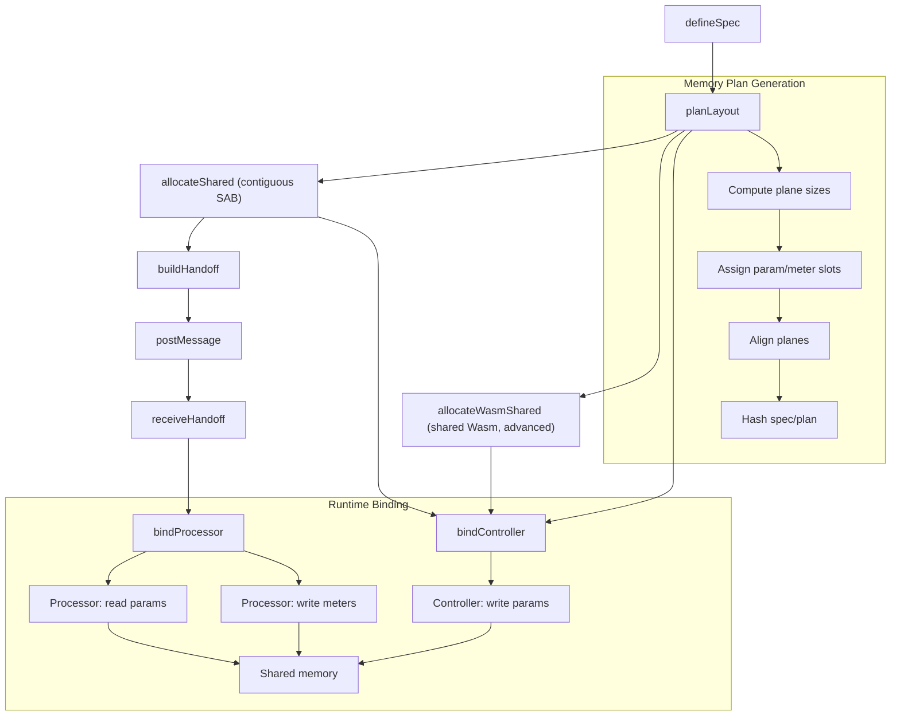
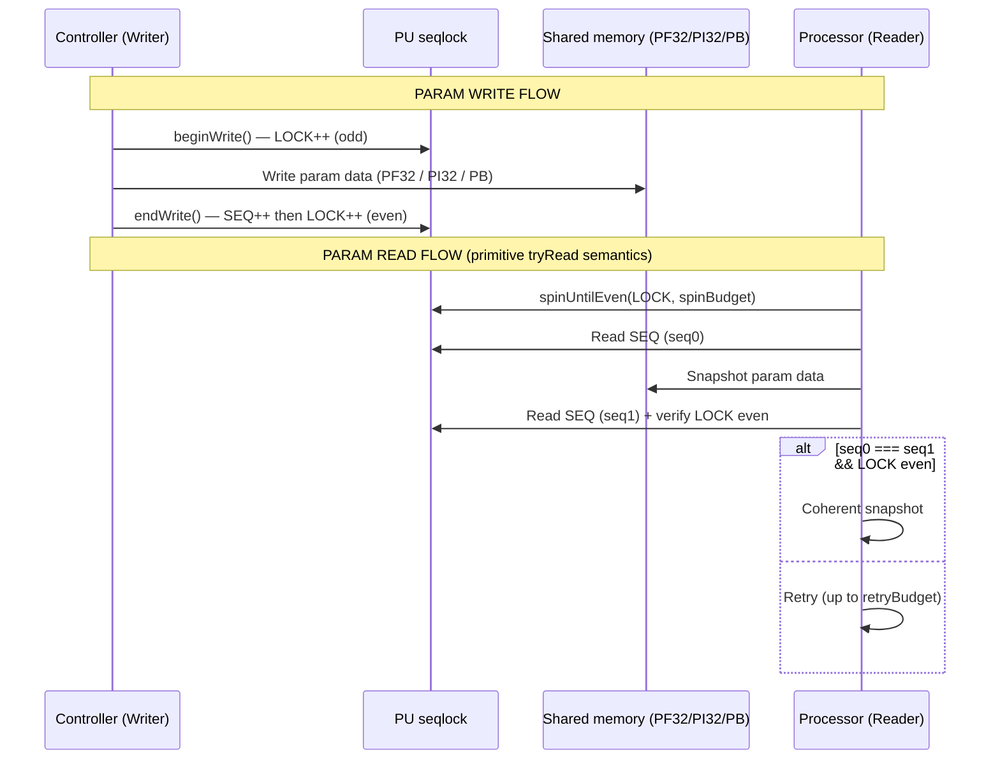
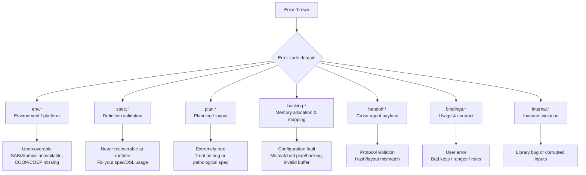
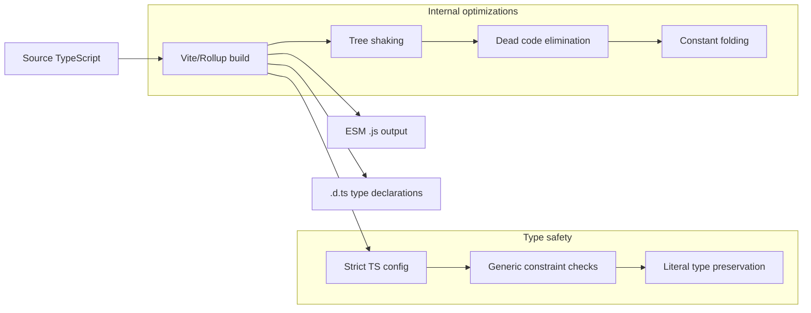
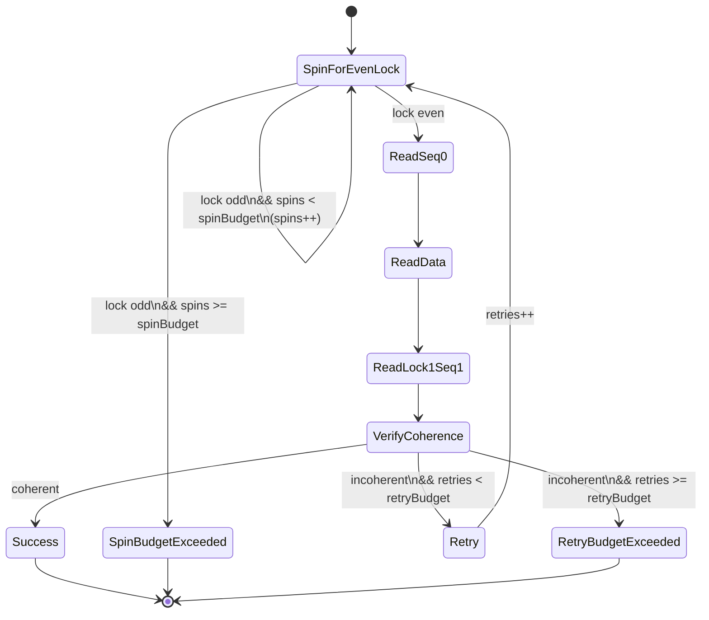
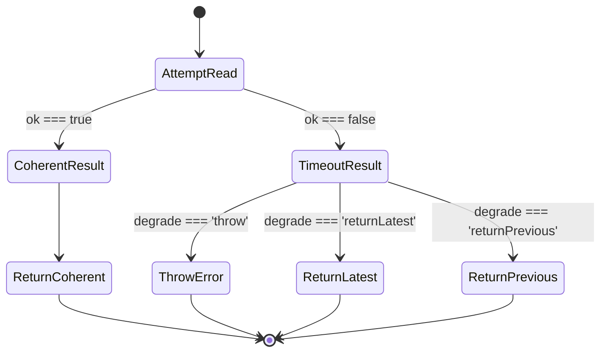

# Seqlok Visual Architecture Notes

> Internal visuals that map the core Seqlok pipeline, memory layout, role separation, and error system.
> These diagrams are explanatory, not normative – exact offsets and internal details may evolve.

---

## 1. End-to-End Flow: From Spec to Shared Memory



**Notes**

- The **golden handoff path** is:
  `defineSpec → planLayout → allocateShared → buildHandoff → postMessage → receiveHandoff → bindProcessor`.
- `allocateWasmShared(plan, memory)` is an **advanced alternative backing** that can feed `bindController`, but does **not
  ** currently feed `buildHandoff` (handoff assumes the contiguous `SharedBacking`).
- Processor side never sees `spec` or raw `plan` – only `Handoff` → `ReceivedHandoff` → `bindProcessor(received)`.

---

## 2. Memory Plane Architecture (Canonical Packing Order)

```text
Shared backing planes (ABI v1)

Plane  Type          Role                              Alignment / Notes
-----  ------------- -------------------------------   ------------------------------
PF32   Float32Array  Param payload (f32 scalars/arrays) 4-byte, packed first
PI32   Int32Array    Param payload (i32, enums)         4-byte
PB     Uint8Array    Param bool payload (0/1)           1-byte
PU     Uint32Array   Param seqlock [LOCK, SEQ]          4-byte elems; may be padded
MF32   Float32Array  Meter payload (f32 scalars/arrays) 4-byte
MF64   Float64Array  Meter payload (f64 scalars/arrays) 8-byte
MU32   Uint32Array   Meter payload (u32/bool meters)    4-byte
MU     Uint32Array   Meter seqlock [LOCK, SEQ]          4-byte elems; may be padded
```

**Notes**

- Canonical **plane set** and element sizes match the backing & primitives docs.

- ABI-stable **packing order** (`BACKING_PLANE_PACK_ORDER_V1`) is:

  ```text
  PF32 → PI32 → PB → PU → MF32 → MF64 → MU32 → MU
  ```

- Actual byte offsets per plane are computed by `planLayout(spec)` from:

  - per-plane byte lengths, and
  - alignment rules (`roundUpTo`, `BYTES_PER_ELEM[plane]`).

- Control planes `PU`/`MU` hold **only** `[LOCK, SEQ]` and may be padded out to at least one cache line; padding is an
  implementation detail, not an ABI promise.

---

## 3. Seqlock Protocol: Writer / Reader Dance



**Notes**

- This is the **primitive** seqlock protocol (`tryRead`-style), not necessarily the exact current binding
  implementation (which may start from this and add convenience).
- On success, the reader sees a **coherent snapshot** (no mixed old/new payload). On failure, it reports a bounded
  spin/retry timeout rather than silently degrading.

---

## 4. Type System Inference Chain

```text
Spec definition → type-safe controller binding
┌─────────────────────────────────────────────────────────────────────────────┐
│ defineSpec(({ param, meter }) => ({                                         │
│   params: {                                                                 │
│     cutoff: param.f32({ min: 20, max: 20_000 }),                            │
│     mode: param.enum({ values: ['normal', 'granular'] }),                   │
│   },                                                                        │
│   meters: {                                                                 │
│     peak: meter.f32({ min: 0, max: 1 }),                                    │
│   },                                                                        │
│ }))                                                                         │
└─────────────────────────────────────────────────────────────────────────────┘
                                │
                                ▼ TypeScript inference
┌─────────────────────────────────────────────────────────────────────────────┐
│ ControllerBinding<{                                                         │
│   params: {                                                                 │
│     cutoff: number;               // from f32                               │
│     mode: 'normal' | 'granular';  // literal union from enum values         │
│   };                                                                        │
│   meters: {                                                                 │
│     peak: number;                // from f32 meter                          │
│   };                                                                        │
│ }>                                                                          │
└─────────────────────────────────────────────────────────────────────────────┘
```

**Notes**

- Inline `values: ['normal', 'granular']` yields a **literal union** – no `as const` needed in TS ≥ 5.x.
- From this single `spec`:

  - `planLayout` derives the memory layout.
  - `bindController` / `bindProcessor` derive the binding types and legal keys/ranges.
  - Handoff verification uses the derived hash.

---

## 5. Error System: Fail-Fast Error Families



**Notes**

- Domains & examples match the structured `SeqlokErrorCode` union and error docs (`env.*`, `backing.*`, `handoff.*`,
  `bindings.*`, etc.).
- Backing and environment errors are **not “recoverable”** in core; callers should treat them as configuration /
  programming faults and fail fast.
- Additional domains like `primitives.*` and `diagnostics.*` exist in the implementation and can be documented in the
  dedicated error doc.

---

## 6. Controller vs Processor: Role Separation

```text
┌─────────────────────┐                ┌───────────────────────┐
│   CONTROLLER        │                │     PROCESSOR         │
│   (Main Thread)     │                │     (Worker/AW)       │
├─────────────────────┤                ├───────────────────────┤
│ • Writes params     │                │ • Reads params         │
│ • Reads meters      │                │ • Writes meters        │
│ • Initiates handoff │◄─ postMessage ─│ • Receives handoff     │
│ • UI integration    │                │ • Audio/DSP / engine   │
└─────────────────────┘                └───────────────────────┘
         │                                      │
         ▼                                      ▼
┌─────────────────────────────────────────────────────────────┐
│                 SHARED MEMORY PLANES                        │
│  ┌─────────────┐                ┌─────────────┐             │
│  │   PARAMS    │                │   METERS    │             │
│  │  PF32/PI32  │◄── Controller  │ MF32/MF64   │◄── Processor│
│  │     PB      │    writes      │    MU32     │   writes    │
│  │             │                │             │             │
│  │      PU     │    Processor   │      MU     │ Controller  │
│  │ [LOCK,SEQ]  │◄── reads       │ [LOCK,SEQ]  │   reads     │
│  └─────────────┘                └─────────────┘             │
└─────────────────────────────────────────────────────────────┘
```

**Notes**

- Exactly one writer per domain:

  - Controller writes **params** + `PU`; processor reads them.
  - Processor writes **meters** + `MU`; controller reads them.

- No one writes into the other side's control plane; SWMR is enforced per domain.

---

## 7. Snapshot Performance Tiers (Controller Side)

```text
Controller meter snapshot usage tiers
┌──────────────────┬──────────────────┬──────────────────┬──────────────────┐
│     TIER 0       │     TIER 1       │     TIER 2       │     TIER 3       │
│   Zero-alloc     │  Single-key      │   Selected keys  │   Full snapshot  │
├──────────────────┼──────────────────┼──────────────────┼──────────────────┤
│ .snapshot({      │ .snapshot(       │ .snapshot(       │ .snapshot()      │
│   into: {        │   ['rms']        │   ['rms',        │                  │
│     spectrum:    │ )                │    'spectrum'],  │                  │
│       buf        │                  │   { into: bufs } │                  │
│   },             │                  │ )                │                  │
│ })               │                  │                  │                  │
│                  │                  │                  │                  │
│ • Reuse buffers  │ • Fast path      │ • Filtered keys  │ • All meters     │
│ • No GC          │ • Minimal copy   │ • Moderate work  │ • Max work       │
└──────────────────┴──────────────────┴──────────────────┴──────────────────┘
```

**Notes**

- Mirrors the documented `meters.snapshot` API: optional keys array + optional `{ into }` object for zero-alloc
  snapshots.
- This is purely about **work level**:

  - TIER 0: zero alloc, fixed buffers, minimal copying.
  - TIER 3: convenient but maximal read bandwidth.

---

## 8. Build Pipeline Overview



**Notes**

- Matches the current build story: ESM-only output, strict TS, and a single public entrypoint, with `index.d.ts`
  mirroring the runtime surface.

---

## 9. Cache Line Isolation Strategy

```text
Seqlock plane isolation (PU/MU)

CPU cache line facts (typical):
  • Apple M-series: often 128B cache lines
  • Many x86-64:     often 64B cache lines

Seqlok backing policy (implementation detail):
  • Treat PU/MU as tiny "control planes" for [LOCK, SEQ].
  • Optionally pad these control planes out to (at least) one cache line
    to reduce false sharing with hot PF32/PI32/MF32/MF64 data.
  • Exact padding/stride is not part of the public ABI and may evolve.

Consequence:
  • Seqlock atomics are kept away from bulk payload data in typical builds.
  • Planner + backing still guarantee:
      - plane alignment by element size, and
      - seqlock planes contain exactly [LOCK, SEQ].
```

---

## 10. Primitive Seqlock `tryRead` State Machine (Per-Call)



**Notes**

- Describes a **single call** to a primitive `tryRead`:

  - Bounded spinning on `LOCK` until even (`spinBudget`).
  - Snapshot of `SEQ` and payload.
  - Re-check (`lock1`, `seq1`) and either succeed or retry.

- Timeouts are split:

  - `SpinBudgetExceeded` → lock never observed even within budget.
  - `RetryBudgetExceeded` → every coherent attempt lost a race.

---

## 11. Higher-Level Acquisition Helper with Degradation Policy



**Notes**

- This diagram is **not part of the seqlock primitive**; it sketches a _caller-side helper_ that decides what to do when
  `tryRead` times out.
- Typical policies:
  - `throw` → fail fast (e.g. for correctness-critical paths).
  - `returnLatest` → best-effort snapshot (HUD-only, non-critical metrics).
  - `returnPrevious` → reuse last known coherent value for stability.
- Keeping degradation out of the primitive preserves a clear separation:
  - Primitive: "Did I get a coherent snapshot within budgets?"
  - Helper: "What should I _do_ if I didn't?"

---
